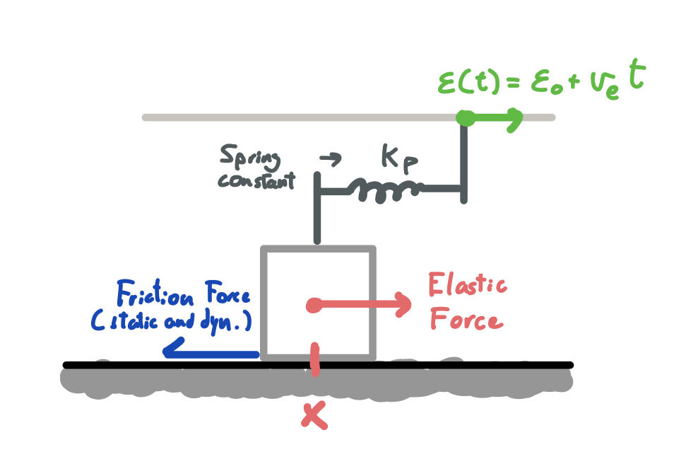

# Earthquake simulator

[Play here](https://bibanez.itch.io/earthquake-simulator)

> The purpose of this simulation is to play with a simple dynamic model that shows
> some of the characteristics of earthquakes.

Earthquakes are often modeled as dynamic models and show chaotic behavior.
From a very simple spring-block model one can observe many similarities with real-life
earthquakes.
Therefore, the purpose of this project is pedagogic: to visualize this very simple
model and reason about the interactions of many spring-blocks in a way that would
be near impossible to do with just pen and paper.

The physics model behind is written specifically for this project and uses the
Leapfrog/Verlet integration model.

## Explanation

The simulation is computed in small increments of time called timesteps, or $\Delta t$.
To give you an idea, for each frame shown approximately 1667 physics timesteps are
computed, all in real time.
After each iteration, the positions, velocities and accelerations for each block
are updated. They are then drawn to the screen when needed.

#### One block

#### Two blocks

#### N-Blocks
We only study one dimension for the blocks, horizontally.
The equations are really simple.
To calculate the acceleration of a block:

$$
a=1/m \cdot (F_p+F_{k_{next}}-F_{k_{prev}}-F_f)$$

$$F_p=\text{Upper spring force},$$

$$F_{k_{next}},F_{k_{prev}}=\text{Inter-block spring force}$$

$$F_f=\text{Friction force (static if }|v| \lt v_\epsilon \text{ and dynamic if else})
$$

The driving that pulls the upper springs forward moves at a constant velocity 
($\epsilon(t)=\epsilon_0+\dot\epsilon(t))$ and is unaffected by the pulling of 
the springs.
Therefore, $F_p=k_p\cdot (\epsilon(t)-x)$ and given a moment in time and the
position of all the blocks, we can obtain the next timestep acceleration for each.

[Leapfrog integration](https://en.wikipedia.org/wiki/Leapfrog_integration) can
be summarized like this:

$$
a_i=a(X_i,v_{i-\frac{1}{2}},t)$$

$$v_{i+\frac{1}{2}}=v_{i-\frac{1}{2}}+a_i\Delta t$$

$$x_{i+1}=x_i+v_{i+\frac{1}{2}}\Delta t
$$

We came up with a modification to this algorithm that is useful for the problem
of dynamic/static friction. This problem is the following:

> If a block's velocity changes sign from one timestep to the next, it must have
> crossed $v = 0$. But if the current absolute value $|v| \geqslant v_\epsilon$ 
> then the model may not apply static friction.

This can happen when the timestep is too wide or the acceleration too great.

To solve this, before computing $x_i$ we check if 
$v_{i+\frac{1}{2}}\cdot v_{i-\frac{1}{2}} \lt 0$ or 
$|v_{i+\frac{1}{2}}| \lt v_\epsilon$, in which case, 
if $m\cdot a_i \lt F_{f_{static}}$, then the acceleration and velocity must be 
set to $v_{i+\frac{1}{2}}=a_i=0$.

## Compiling

You should install [Raylib](https://www.raylib.com/) on your system and make
sure to have a working development environment. Any recent version of the software
should do just fine for compiling this project.
You can read the Makefile in this repository to see the compilation commands 
(tested with Arch Linux).

To compile to web, you need to install [Emscripten](https://emscripten.org/docs/getting_started/downloads.html).
Then, after setting up the SDK header files, the `emcc` command in the Makefile
should compile the program with the specific html shell in this repository.

I know I'm sparse in details, but if you want to compile this project and don't
know how, send me an email to [bibanez135\@gmail.com](mailto:bibanez135@gmail.com).

## Special thanks to

Jordi Baró i Urbea for guiding me in the project development.

The Centre de Recerca Matemàtica (CRM) in Catalonia, where I hacked this project
from scratch in one week (from the 5th to the 11th of September).

Raylib, Emscripten and C++.
